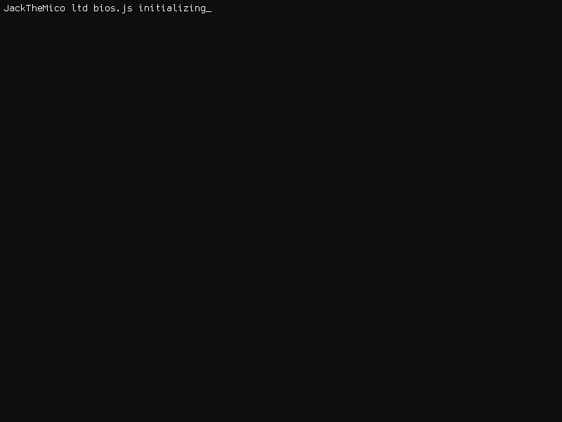

<!-- visitor counter -->

  
  

<picture>
  

    
  

</picture>

<picture>

  

    
  

</picture>

## Some facts about me

[my awesome stars list](./starred.md)

### My Github Followers
<!--ACTION_START_FLAG:github-followers-->
<table>
  <tr>
    <td align="center">
        
         
        <a href="https://github.com/KevinHock">KevinHock</a>
    </td>
    <td align="center">
        
         
        <a href="https://github.com/esin">Andrey Esin</a>
    </td>
    <td align="center">
        
         
        <a href="https://github.com/deepsea514">Deep Sea</a>
    </td>
    <td align="center">
        
         
        <a href="https://github.com/plh97">plh</a>
    </td>
    <td align="center">
        
         
        <a href="https://github.com/ipqwery">IPQuery</a>
    </td>
    <td align="center">
        
         
        <a href="https://github.com/jessuppi">Jesse Nickles</a>
    </td>
    <td align="center">
        
         
        <a href="https://github.com/SPSEBASTIAAN">Sebastiaan</a>
    </td>
  </tr>
  <tr>
    <td align="center">
        
         
        <a href="https://github.com/surfskyio">Surfsky</a>
    </td>
    <td align="center">
        
         
        <a href="https://github.com/mishin">Nikolay Mishin</a>
    </td>
    <td align="center">
        
         
        <a href="https://github.com/ibrahimkettaneh">Ibrahim Kettaneh</a>
    </td>
    <td align="center">
        
         
        <a href="https://github.com/linzo21">linzo21</a>
    </td>
    <td align="center">
        
         
        <a href="https://github.com/chance395">liang.li</a>
    </td>
    <td align="center">
        
         
        <a href="https://github.com/LLLLM01">LLLLM</a>
    </td>
    <td align="center">
        
         
        <a href="https://github.com/RuixiangS">lumir</a>
    </td>
  </tr>
  <tr>
    <td align="center">
        
         
        <a href="https://github.com/tharindu257">Tharindu Dilshan</a>
    </td>
    <td align="center">
        
         
        <a href="https://github.com/684201zan">奔走的小毛驴</a>
    </td>
  </tr>
</table>
<!--ACTION_END_FLAG:github-followers-->

### Terminal Readme

<picture>
    
</picture>
